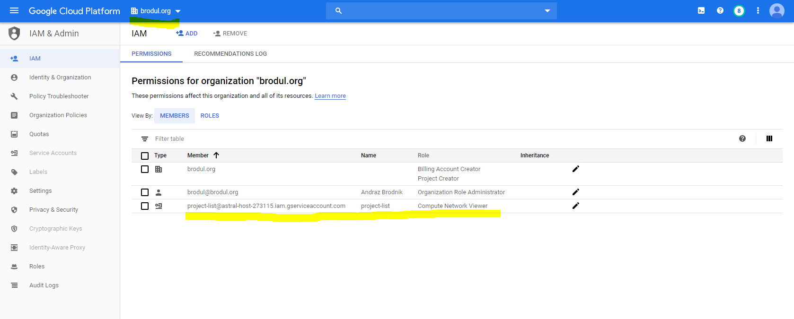

# Prerequisites

- You need one project where the service account for the application will live
- For that project you need to enable Cloud Resource Manager API
- Create a service account without any roles in that project
- Create JSON key for that service account and download it
- Remember the email address of the service account
- You need to grant https://cloud.google.com/compute/docs/access/iam#compute.networkViewer role to the service account on organization level. (You will need the email of the service account to do so)

- You need `google-api-python-client` python lib installed
- Script will run with modern python 3 only

# Assumptions

- Script will work on Active projects (no pending for deletion)
- Script will ignore projects with Compute API disabled

# How to run

`python gcp_ip.py c://Users/brodul/Downloads/service_account_key.json`

# Format

Script returns `IP_ADDRESS,TYPE,STATUS` e.g. `35.222.61.17,EXTERNAL,RESERVED`. You can use `cut -d ',' -f 1` to get only IP address or modify the script.
